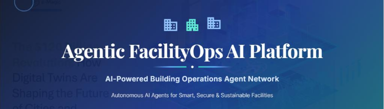

# Agentic FacilityOps AI Platform

**AI-Powered Building Operations Agent Network**

---

## 📌 Overview

An autonomous AI-powered facility operations platform designed to continuously monitor, optimize, and secure large-scale buildings. Multiple intelligent agents collaborate to process IoT sensor data, reduce operational costs, and predict maintenance needs.

## ✨ Core Capabilities

*   **Energy Intelligence Agent:** Real-time utility monitoring and anomaly detection.
*   **Predictive Maintenance Agent:** Asset health scoring and proactive failure alerts.
*   **Occupancy & Security Agents:** Space utilization analytics and incident tracking.
*   **Cost Optimization Agent:** Automated budget tracking and resource allocation recommendations.

## 🛠️ Tech Stack

*   **Environment Setup:** NixOS with `devenv` & `direnv`
*   **Frontend:** React, Vite, Tailwind CSS, Recharts
*   **Backend:** Node.js, Express.js
*   **Database:** MongoDB Atlas (Mongoose)

<!--
## 🚀 Live Deployment

*   **Frontend Application:** [View on Vercel](#) *(Replace with your Vercel URL)*
*   **Backend API Service:** [Hosted on Render](#) *(Replace with your Render URL)*
-->

---

  <i>Built for Smart, Secure & Sustainable Facilities.</i>

